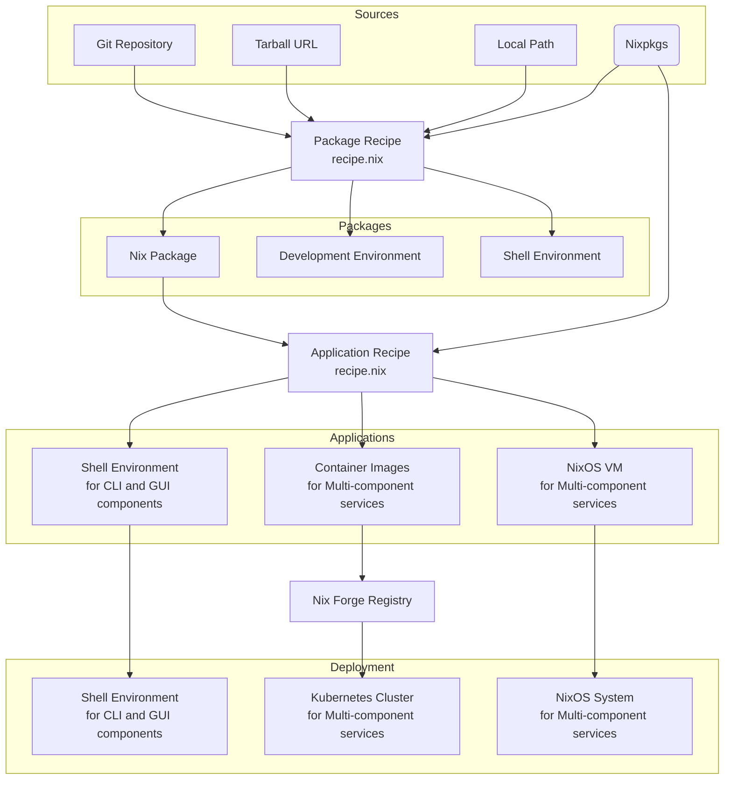

# NGI Nix Forge

**WARNING: this sofware is currently in alpha state of development.**

## Features

* Simple, type checked configuration recipes for **packages** and
  **mutli-component applications** using
  [module system](https://nix.dev/tutorials/module-system/index.html)

* [Web UI](https://ngi-nix.github.io/ngi-nix-forge)

* [LLMs support](./AGENTS.md)

* Easy [self hosting](#self-hosting)


### Conceptual diagram



## Self hosting

* Initiate new Nix Forge instance from template

```bash
nix flake init --template github:ngi-nix/ngi-nix-forge#example
```

* Set `repositoryUrl` attribute in `flake.nix` to your repository

* Add all new files to git

* Start creating recipes  in `recipes` directory


## LLM agents

LLM agents, read [these instructions](./AGENTS.md) first.


## Credits

This software was originally started as a fork of
[imincik/nix-forge](https://github.com/imincik/nix-forge).
